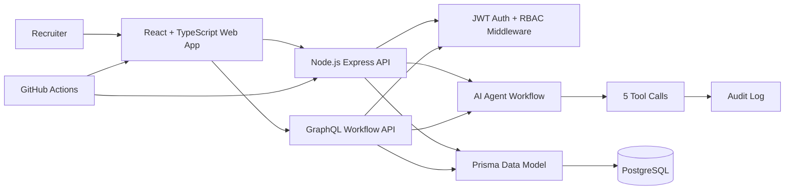
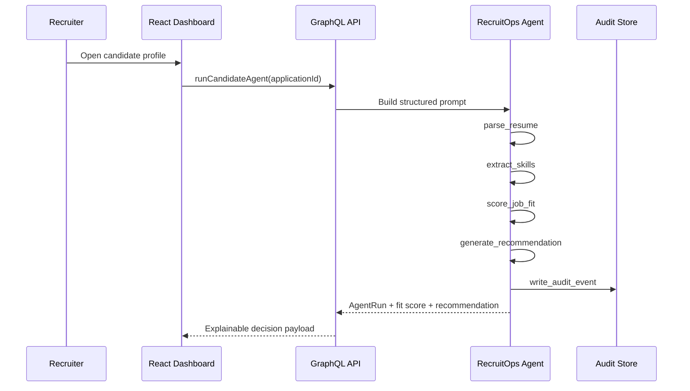

# RecruitOps AI

RecruitOps AI is a fullstack AI recruiter agent platform built as a production-style portfolio project for AI Builder / agentic workflow roles. It demonstrates maintainable React/TypeScript UI, Node.js APIs, a GraphQL recruiter workflow surface, PostgreSQL-ready Prisma modeling, JWT authentication, deterministic agent reasoning, auditable tool calls, CI, Docker, and clear architecture.

## Tech Stack

- React + TypeScript + Vite
- Node.js + Express + TypeScript
- GraphQL-over-HTTP recruiter workflow endpoint
- PostgreSQL-ready Prisma schema
- JWT authentication pattern
- Zod request validation
- Docker Compose
- GitHub Actions CI
- Deterministic AI agent workflow with structured prompts
- Optional future LLM provider adapter

## Product Features

- Recruiter dashboard for an active AI Builder opening
- Candidate search, source filtering, and stage filtering
- Candidate ranking with AI match scores
- Agent workflow trace with 5 tool-call steps: resume parsing, skill extraction, job-fit scoring, recommendation generation, and audit logging
- Candidate profile inspector with parsed skills and experience
- Shortlist/reject workflow with local UI state updates
- Stage transitions across hiring pipeline states
- Audit trail for AI recommendations and recruiter actions
- REST API for auth, jobs, candidates, stage updates, and agent match scoring
- GraphQL API with 7 query operations and 4 mutations for jobs, candidates, applications, agent runs, audit events, stage updates, and agent execution
- PostgreSQL-ready Prisma schema for users, jobs, candidates, applications, match results, agent runs, tool calls, pipeline events, and audit events
- Seeded demo API for portfolio review without requiring private data or API keys
- Demo dataset with 30 candidates, 6 job openings, and generated audit/agent history

## Architecture



## Agent Flow



## Data Model

Core tables modeled in [prisma/schema.prisma](./prisma/schema.prisma):

- `User`
- `Job`
- `Candidate`
- `Application`
- `AiMatchResult`
- `AgentRun`
- `AgentToolCall`
- `PipelineEvent`
- `AuditEvent`

The schema is designed around recruiter workflows rather than one-off resume analysis. A candidate can apply to multiple jobs, each application can move through a pipeline, and every AI score can be audited separately.

## Local Development

```bash
npm install
cp .env.example .env
npm run dev
```

Demo login:

```text
alex@recruitops.ai / Password123!
```

## Docker

```bash
docker compose up --build
```

## API Surface

```text
POST   /api/auth/login
GET    /api/jobs
POST   /api/jobs
GET    /api/candidates
POST   /api/candidates
PATCH  /api/candidates/applications/:applicationId/stage
POST   /api/candidates/applications/:applicationId/score
POST   /graphql
GET    /graphql/schema
GET    /health
```

GraphQL operations supported by the portfolio API:

```text
Query:    jobs, job, candidates, candidate, applications, agentRuns, auditEvents
Mutation: runCandidateAgent, updateApplicationStage, createCandidate, createJob
```

Example:

```bash
curl -X POST http://localhost:4000/graphql \
  -H "Authorization: Bearer $TOKEN" \
  -H "Content-Type: application/json" \
  -d '{"query":"mutation Run($applicationId: ID!) { runCandidateAgent(applicationId: $applicationId) { id fitScore confidence recommendation } }","variables":{"applicationId":"app_aisha"}}'
```

## Resume-Ready Scope

- 30 seeded candidate profiles across AI, fullstack, backend, data, frontend, and DevOps backgrounds
- 6 job openings, including an AI Builder role aligned to React, TypeScript, Python, GraphQL, prompts, and tool workflows
- 7 query operations and 4 mutations exposed through a GraphQL recruiter workflow endpoint
- 5-step agent workflow with structured prompt generation, tool-call traces, confidence scores, recommendations, and audit events
