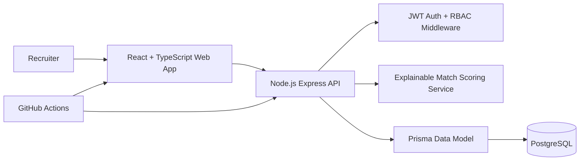

# RecruitOps AI

RecruitOps AI is a fullstack AI recruiter workflow platform built as an optimized, original version of common AI hiring co-pilot demos. It focuses on production engineering signals: maintainable React/TypeScript UI, Node.js REST APIs, PostgreSQL-ready data modeling, Prisma schema design, JWT authentication shape, deterministic AI scoring fallback, CI, Docker, and clear architecture.

This project is intentionally not a clone of RecruitAI or Zara. It uses the same real-world recruiting problem space, but with a different product model, data schema, UI system, and implementation structure.

## Tech Stack

- React + TypeScript + Vite
- Node.js + Express + TypeScript
- PostgreSQL-ready Prisma schema
- JWT authentication pattern
- Zod request validation
- Docker Compose
- GitHub Actions CI
- Deterministic explainable AI matching fallback
- Optional future LLM provider adapter

## Product Features

- Recruiter dashboard for an active job opening
- Candidate search, source filtering, and stage filtering
- Candidate ranking with AI match scores
- Candidate profile inspector with parsed skills and experience
- Shortlist/reject workflow with local UI state updates
- Stage transitions across hiring pipeline states
- Audit trail for AI recommendations and recruiter actions
- REST API for auth, jobs, candidates, stage updates, and match scoring
- PostgreSQL-ready Prisma schema for users, jobs, candidates, applications, match results, pipeline events, and audit events
- Seeded demo API for portfolio review without requiring private data or API keys

## Architecture



## Data Model

Core tables modeled in [prisma/schema.prisma](./prisma/schema.prisma):

- `User`
- `Job`
- `Candidate`
- `Application`
- `AiMatchResult`
- `PipelineEvent`
- `AuditEvent`

The schema is designed around recruiter workflows rather than one-off resume analysis. A candidate can apply to multiple jobs, each application can move through a pipeline, and every AI score can be audited separately.

## Local Development

```bash
npm install
cp .env.example .env
npm run dev
```

Demo login:

```text
alex@recruitops.ai / Password123!
```

## Docker

```bash
docker compose up --build
```

## API Surface

```text
POST   /api/auth/login
GET    /api/jobs
POST   /api/jobs
GET    /api/candidates
POST   /api/candidates
PATCH  /api/candidates/applications/:applicationId/stage
POST   /api/candidates/applications/:applicationId/score
GET    /health
```

